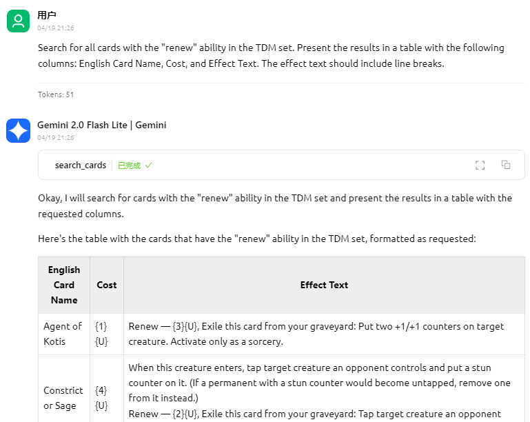

# Academy Ruins (sbwsz.com) MCP Server

English | [中文](../README.md)

A server based on [Model Context Protocol (MCP)](https://modelcontextprotocol.io/) for interacting with the [Academy Ruins - SBWSZ](https://sbwsz.com/) API. Provides a set of tools for querying Magic: The Gathering card Chinese information.

[](https://smithery.ai/server/@lieyanqzu/sbwsz-mcp)

<a href="https://glama.ai/mcp/servers/@lieyanqzu/sbwsz-mcp">
  
</a>

## API Documentation

This server is based on the public API of Academy Ruins. You can view the complete API documentation at:

- [Academy Ruins API Documentation](https://new.sbwsz.com/api/v1/docs)

## Use Case



## Features

- **get_card_by_set_and_number**  
  Get a single card by set code and collector number.
- **search_cards**  
  Search cards using a query string, with support for pagination and sorting. Supports complex query syntax, such as `t:creature c:r` (red creatures) or `pow>=5 or mv<2` (power greater than or equal to 5 or mana value less than 2).
- **get_sets**  
  Get information about all card sets.
- **get_set**  
  Get detailed information about a single set.
- **get_set_cards**  
  Get all cards from a specific set, with support for pagination and sorting.
- **hzls**  
  Creates a composite image by arranging Chinese Magic card name sections to spell out the input sentence.

## Usage

The server supports two running modes:

1. Standard stdio mode (default)
2. Stateless Streamable HTTP mode, providing HTTP endpoints

### Using NPX

If you have Node.js installed locally:

```bash
# Stdio mode
npx sbwsz-mcp-server

# Streamable HTTP mode
npx sbwsz-mcp-server --http
```

### Connecting to the Server

#### Stdio Mode

Your application or environment (such as Claude Desktop) can communicate directly with the server through stdio.

#### Streamable HTTP Mode

When running in Streamable HTTP mode (using the `--http` parameter):

The server will be available at the following endpoint:

- Streamable HTTP endpoint: `http://localhost:3000/mcp`

This mode operates in a stateless manner, without maintaining session information, providing a simplified and more efficient communication method.

### Integration in claude_desktop_config.json

Example configuration for stdio mode:

```json
{
  "mcpServers": {
    "sbwsz": {
      "command": "docker",
      "args": ["run", "-i", "--rm", "mcp/sbwsz"]
    }
  }
}
```

Or using npx:

```json
{
  "mcpServers": {
    "sbwsz": {
      "command": "npx",
      "args": ["sbwsz-mcp-server"]
    }
  }
}
```

### Building with Docker

```bash
docker build -t mcp/sbwsz .
```

Then you can run in stdio mode:

```bash
docker run -i --rm mcp/sbwsz
```

Or in Streamable HTTP mode:

```bash
docker run -i --rm -p 3000:3000 mcp/sbwsz --http
``` 